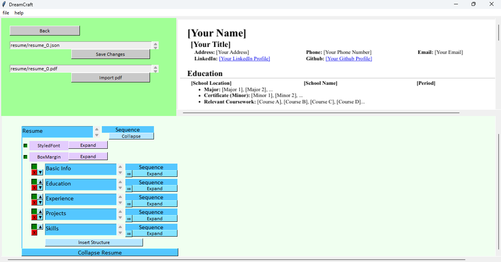

# DreamCraft
[](https://opensource.org/licenses/MIT)

A <b>resume editor</b> with a user-friendly UI that offers helpful features for <b>quick resume editing and formatting</b>. Users can efficiently <b>structure</b> their resumes and view a <b>preview</b> of their resume before finalizing. The application also allows users to <b>customize</b> their resume by selecting resume elements and importing a PDF file with the selected elements, ensuring a streamlined and customized resume creation process. <b>This means you can first include all everything about you, store them in the resume content file, and select the required items according to the role when you are importing the pdf</b>.

## Key Features
- <b>Cross Platform </b>
- <b>Text Editions</b>
- <b>Font Styles Decorations</b>
- <b>Layout Formatting</b>
- <b>Live Preview</b>
- <b>Resume Components Management</b>
- <b>Customize & Save PDF</b>
- <b>Build-in Resume Template</b>
- <b>Smooth Resizing </b>
- <b>Easy Scrolling</b>


## Getting Started

1. Navigate to the directory you want to put the application and clone this repository:
    ```bash
    gh repo clone ivzeng/DreamCraft-Resume-Editor
    ```

2. Install the required packages from `requirements.txt`:
    ```bash
    pip install -r requirements.txt
    ```
    or
    ```bash
    pip3 install -r requirements.txt
    ```
2. Initialize Playwright:
    ```bash
    playwright install
    ```
4. Run main.py. Make sure that you have Python ($\ge$ 3.10) installed.


## Emailware

Please feel free to email me at ivanyhzeng@gmail.com with anything you'd like to say about this software. I'd appreciate it!


## UI

- Main Menu
    

- Workspace
    
    
    

## References

- Resume Template: https://www.freecodecamp.org/news/writing-a-killer-software-engineering-resume-b11c91ef699d/


#### Happy job searching!
